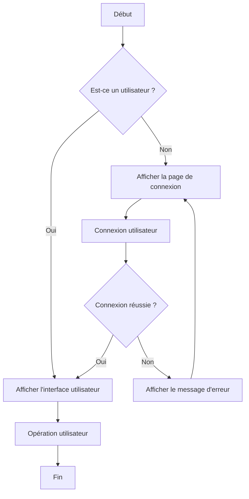
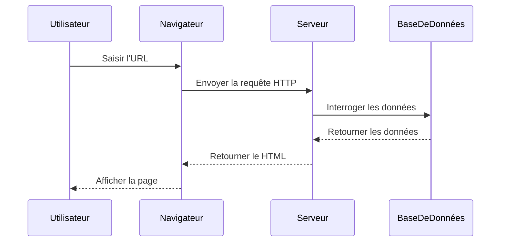
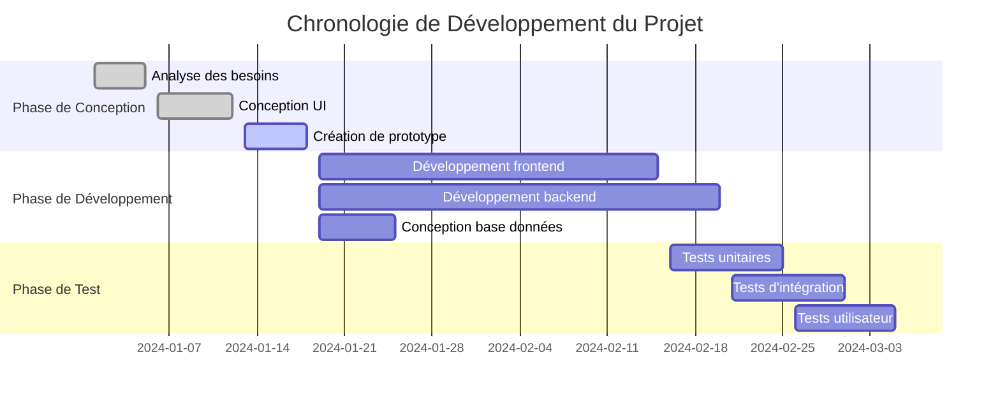
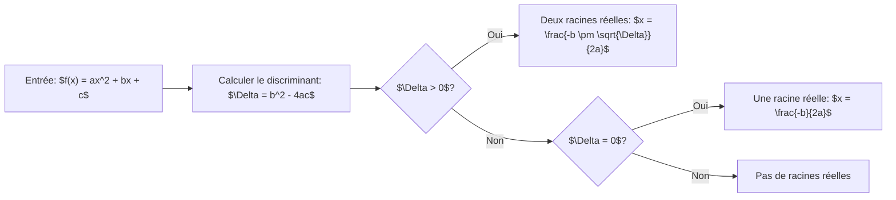

# Test KaTeX et Mermaid

Cet article est utilisé pour tester le rendu des formules mathématiques KaTeX et la fonctionnalité des graphiques Mermaid.

## Test des Graphiques Mermaid

### Diagramme de Flux

### Diagramme de Séquence

### Diagramme de Gantt

## Test KaTeX

### Formules en Ligne

Ceci est une formule en ligne : $E = mc^2$, la formule d'équivalence masse-énergie d'Einstein.

Autre exemple : Quand $a \neq 0$, les solutions de l'équation quadratique $ax^2 + bx + c = 0$ sont $x = \frac{-b \pm \sqrt{b^2-4ac}}{2a}$.

### Formules en Bloc
#### Formule Quadratique
$$x = \frac{-b \pm \sqrt{b^2-4ac}}{2a}$$

#### Formule d'Euler
$$e^{i\pi} + 1 = 0$$

#### Formule d'Intégrale
$$\int_{-\infty}^{\infty} e^{-x^2} dx = \sqrt{\pi}$$

#### Représentation Matricielle
$$\begin{pmatrix} a & b \\ c & d \end{pmatrix} \begin{pmatrix} x \\ y \end{pmatrix} = \begin{pmatrix} ax + by \\ cx + dy \end{pmatrix}$$

#### Formule de Sommation
$$\sum_{n=1}^{\infty} \frac{1}{n^2} = \frac{\pi^2}{6}$$

#### Équation Différentielle
$$\frac{d^2y}{dx^2} + \omega^2 y = 0$$

#### Transformée de Fourier
$$F(\omega) = \int_{-\infty}^{\infty} f(t) e^{-i\omega t} dt$$

#### Série de Taylor
$$f(x) = \sum_{n=0}^{\infty} \frac{f^{(n)}(a)}{n!}(x-a)^n$$

### Expressions Mathématiques Complexes

#### Fonction de Densité de Probabilité
$$f(x) = \frac{1}{\sigma\sqrt{2\pi}} e^{-\frac{1}{2}\left(\frac{x-\mu}{\sigma}\right)^2}$$

#### Équations de Maxwell
$$\begin{align}
\nabla \cdot \mathbf{E} &= \frac{\rho}{\epsilon_0} \\
\nabla \cdot \mathbf{B} &= 0 \\
\nabla \times \mathbf{E} &= -\frac{\partial \mathbf{B}}{\partial t} \\
\nabla \times \mathbf{B} &= \mu_0\mathbf{J} + \mu_0\epsilon_0\frac{\partial \mathbf{E}}{\partial t}
\end{align}$$

#### Équation de Schrödinger
$$i\hbar\frac{\partial}{\partial t}\Psi(\mathbf{r},t) = \hat{H}\Psi(\mathbf{r},t)$$

## Test de Combinaison

### Diagramme de Flux avec Formules

### Explication de Concept Mathématique

En mathématiques, le **nombre d'or** $\phi$ est défini comme :

$$\phi = \frac{1 + \sqrt{5}}{2} \approx 1.618$$

Il satisfait la propriété suivante :

$$\phi^2 = \phi + 1$$

Cette proportion a des applications étendues dans la nature et l'art.

---

Cette page de test montre diverses fonctionnalités de KaTeX et Mermaid, incluant des formules mathématiques complexes et plusieurs types de graphiques.
