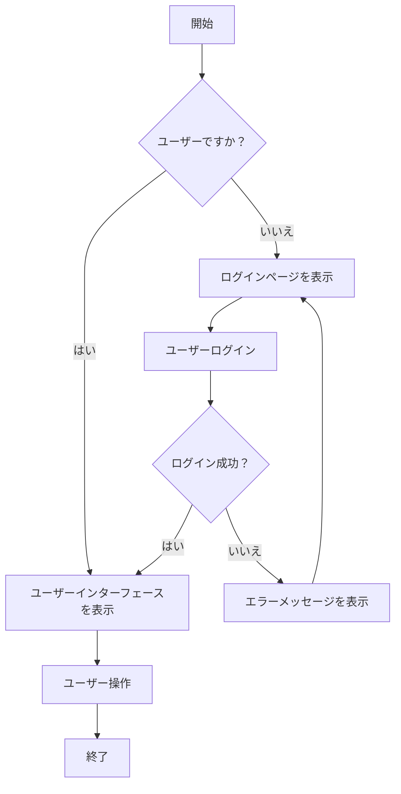
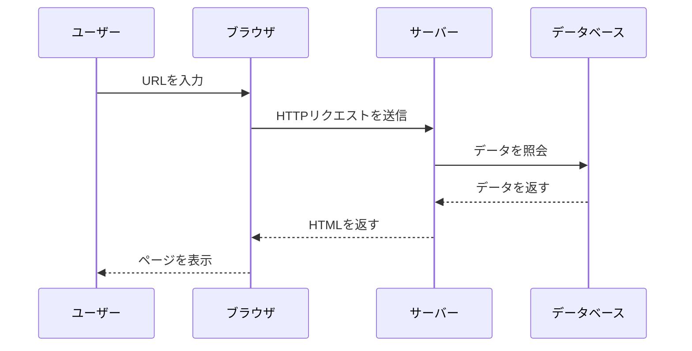
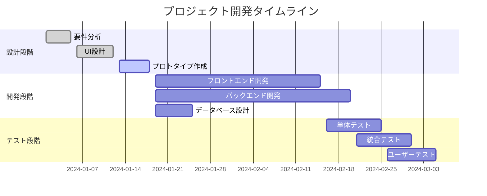
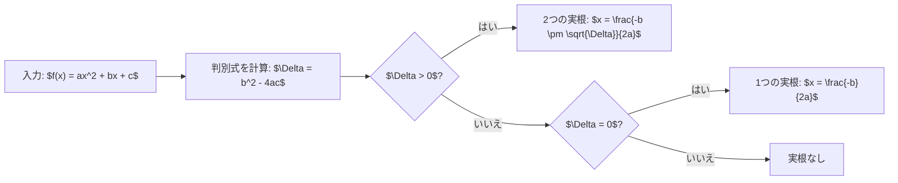

# KaTeXとMermaidテスト

この記事はKaTeX数式レンダリングとMermaidチャート機能をテストするために使用されます。

## Mermaidチャートテスト

### フローチャート

### シーケンス図

### ガントチャート

## KaTeXテスト

### インライン数式

これはインライン数式です：$E = mc^2$、アインシュタインの質量エネルギー等価式。

別の例：$a \neq 0$ のとき、二次方程式 $ax^2 + bx + c = 0$ の解は $x = \frac{-b \pm \sqrt{b^2-4ac}}{2a}$ です。

### ブロック数式
#### 二次公式
$$x = \frac{-b \pm \sqrt{b^2-4ac}}{2a}$$

#### オイラーの公式
$$e^{i\pi} + 1 = 0$$

#### 積分公式
$$\int_{-\infty}^{\infty} e^{-x^2} dx = \sqrt{\pi}$$

#### 行列表現
$$\begin{pmatrix} a & b \\ c & d \end{pmatrix} \begin{pmatrix} x \\ y \end{pmatrix} = \begin{pmatrix} ax + by \\ cx + dy \end{pmatrix}$$

#### 総和公式
$$\sum_{n=1}^{\infty} \frac{1}{n^2} = \frac{\pi^2}{6}$$

#### 微分方程式
$$\frac{d^2y}{dx^2} + \omega^2 y = 0$$

#### フーリエ変換
$$F(\omega) = \int_{-\infty}^{\infty} f(t) e^{-i\omega t} dt$$

#### テイラー級数
$$f(x) = \sum_{n=0}^{\infty} \frac{f^{(n)}(a)}{n!}(x-a)^n$$

### 複雑な数学表現

#### 確率密度関数
$$f(x) = \frac{1}{\sigma\sqrt{2\pi}} e^{-\frac{1}{2}\left(\frac{x-\mu}{\sigma}\right)^2}$$

#### マクスウェル方程式
$$\begin{align}
\nabla \cdot \mathbf{E} &= \frac{\rho}{\epsilon_0} \\
\nabla \cdot \mathbf{B} &= 0 \\
\nabla \times \mathbf{E} &= -\frac{\partial \mathbf{B}}{\partial t} \\
\nabla \times \mathbf{B} &= \mu_0\mathbf{J} + \mu_0\epsilon_0\frac{\partial \mathbf{E}}{\partial t}
\end{align}$$

#### シュレーディンガー方程式
$$i\hbar\frac{\partial}{\partial t}\Psi(\mathbf{r},t) = \hat{H}\Psi(\mathbf{r},t)$$

## 組み合わせテスト

### 数式付きフローチャート

### 数学概念の説明

数学において、**黄金比** $\phi$ は次のように定義されます：

$$\phi = \frac{1 + \sqrt{5}}{2} \approx 1.618$$

これは以下の性質を満たします：

$$\phi^2 = \phi + 1$$

この比率は自然界と芸術の両方で広く応用されています。

---

このテストページはKaTeXとMermaidの様々な機能を示しており、複雑な数学式と複数種類のチャートが含まれています。
